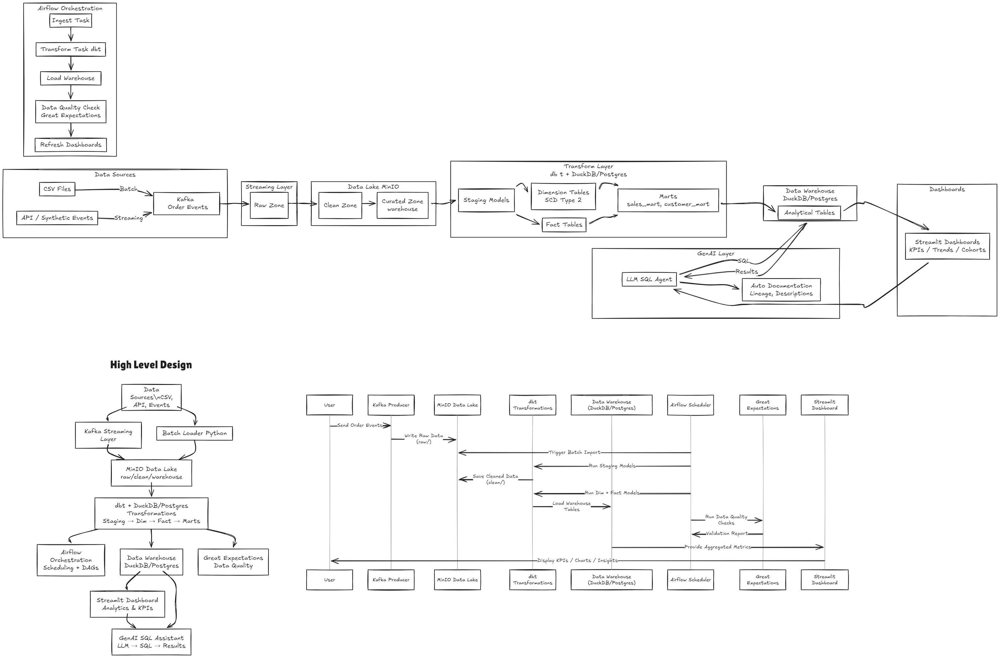
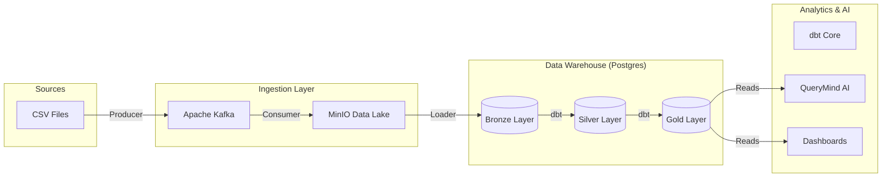
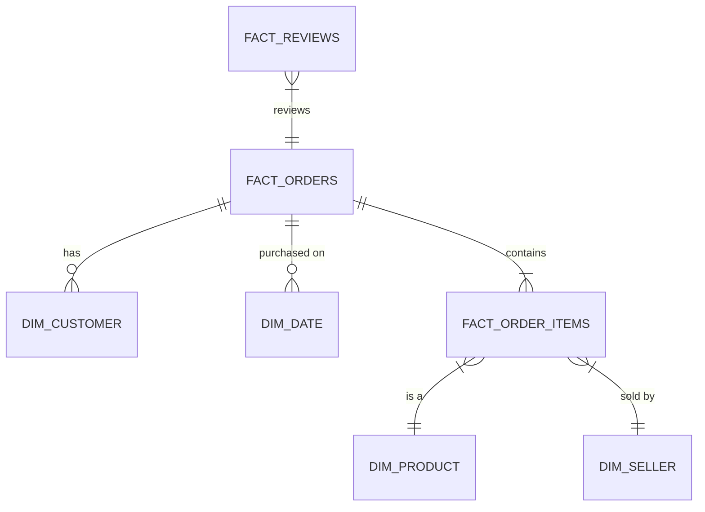

# 🚀 QueryMind: Data Warehouse & AI Analytics Platform

[](https://www.kaggle.com/datasets/olistbr/brazilian-ecommerce)
[](https://www.databricks.com/glossary/medallion)
[]()

Production-grade data platform implementing a **Medallion Architecture** (Bronze/Silver/Gold) on the Olist Brazilian E-Commerce dataset. This project integrates a traditional SQL warehouse with a modern data stack, featuring an end-to-end ELT pipeline, LLM-powered analytics (**QueryMind**), and interactive dashboards.

---

## 🏗️ Architecture

The platform follows a modern data stack approach, processing data from raw CSVs to actionable insights.





### Data Layers
1. **Bronze (Raw)**: Direct ingest from CSVs. Exact copies of source structure.
2. **Silver (Cleaned)**: Deduplicated, standardized, properly cast types.
   - *Transformations*: Trimming, Lowercase/Uppercase standardization, Timestamp conversion, NULL handling.
3. **Gold (Dimensional)**: Star Schema for analytics.
   - *Facts*: `fact_orders`, `fact_order_items`, `fact_payments`, `fact_reviews`
   - *Dimensions*: `dim_customer` (SCD Type 2), `dim_product`, `dim_seller`, `dim_date`

### Data Model (Gold Layer)


---

## 🛠️ Technology Stack

- **Ingestion**: Apache Kafka, MinIO (S3-compatible object storage)
- **Orchestration**: Apache Airflow
- **Warehousing**: PostgreSQL
- **Transformation**: dbt Core (Data Build Tool)
- **Application**: Streamlit (Dashboards & AI Interface)
- **AI/LLM**: OpenAI GPT-4 (via QueryMind)

---

## 🚀 Quick Start

### Prerequisites
- Docker & Docker Compose
- Python 3.10+
- OpenAI API Key (for QueryMind)

### 1. Start Infrastructure
Launch the containerized environment (Postgres, Kafka, MinIO, Airflow):
```bash
docker-compose up -d
```

### 2. Configure Environment
Create a `.env` file in the root directory:
```env
OPENAI_API_KEY=sk-...
POSTGRES_HOST=localhost
POSTGRES_USER=warehouse_user
POSTGRES_PASSWORD=warehouse_pass
POSTGRES_DB=warehouse_db
```

### 3. Initialize & Load Data
You can run the end-to-end pipeline via Airflow or execute individual steps.

**Option A: Airflow (Recommended)**
1. Access Airflow at `http://localhost:8080` (Credentials: `admin`/`admin`).
2. Trigger the `olist_etl_pipeline` DAG.


**Option B: Manual Execution**
1. Load Bronze Layer (Raw):
   ```bash
   psql -h localhost -U warehouse_user -d warehouse_db -f scripts/bronze/00_run_all_bronze.sql
   ```
   *(Note: individual scripts are in `scripts/bronze/`)*

2. Build Silver & Gold Layers (dbt):
   ```bash
   cd dbt
   dbt run
   ```

---

## 📂 Project Structure

```
.
├── app/                # Streamlit Application (AI Interface)
├── dashboards/         # Analytical Dashboards (Streamlit)
├── data_utils/         # Data Generation & Validation Utilities
├── datasets/           # Raw CSV Files (Olist Dataset)
├── dbt/                # dbt Project (Transformations & Tests)
├── kafka/              # Kafka Producers & Consumers
├── llm/                # QueryMind AI Core Logic
├── scripts/            # SQL & Shell Scripts
│   ├── bronze/         # DDL & Copy commands for Raw Data
│   ├── silver/         # (Legacy) SQL Scripts for Silver
│   └── gold/           # (Legacy) SQL Scripts for Gold
└── tests/              # Additional SQL Tests
```

---

## 🧠 QueryMind: AI Analytics

QueryMind allows natural language querying of the Gold schema. It ensures safety by being **Read-Only** and context-aware.

**How to Run**:
```bash
streamlit run app/streamlit_app.py
```


**Features**:
- **Zero-Config Schema Awareness**: Automatically builds prompts from dbt metadata.
- **Strictly Read-Only**: Validator blocks harmful commands.
- **Gold-Layer Only**: Restricts queries to the analytical schema.

---

## 📊 Analytics Dashboards

Interactive visualization of key metrics built with Streamlit.

**How to Run**:
```bash
streamlit run dashboards/app.py
```


**Key Modules**:
- **Executive Overview**: High-level KPIs.
- **Micro-Segmentation**: Customer analysis.
- **Operations**: Delivery & Logistics performance.

---

## 👩‍💻 Development

### dbt Workflow
To modify transformations or add new models:
1. Edit models in `dbt/models/`.
2. Run tests to ensure integrity:
   ```bash
   dbt test
   ```
3. Generate documentation:
   ```bash
   dbt docs generate
   dbt docs serve
   ```

### Python/App Development
- **Streamlit**: App code is in `app/` and `dashboards/`.
- **LLM Logic**: Logic resides in `llm/` (Prompt Engineering, SQL Generation).

---

## 🧪 Testing

The project includes multiple testing layers:
1. **dbt Tests**: Schema tests (unique, not_null) and custom data tests.
2. **SQL Tests**: Legacy tests in `tests/*.sql` for row counts and FK integrity.
3. **Unit Tests**: Python tests for the LLM components.
