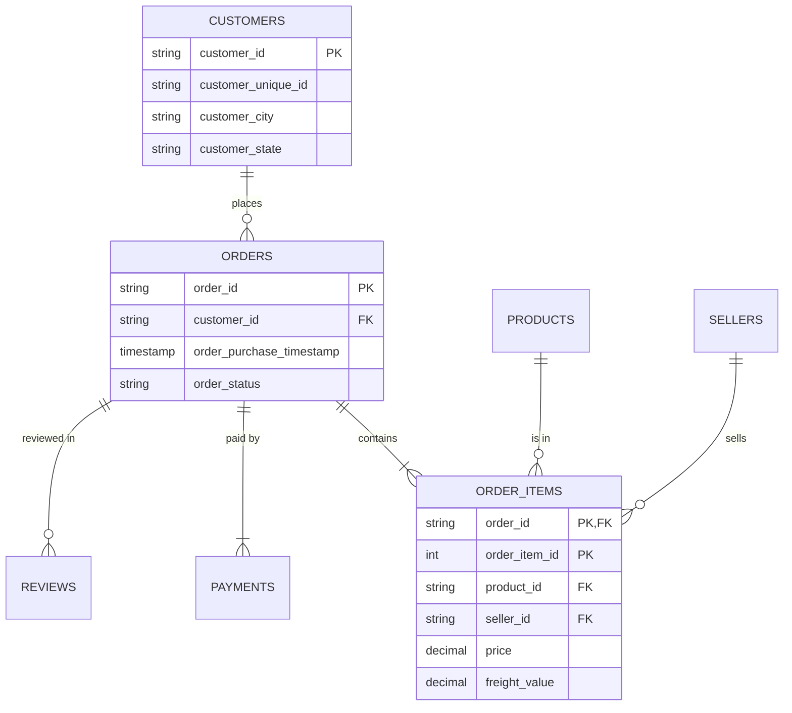

# Silver Layer - Data Integration & Schema

The **Silver Layer** stores cleaned, deduplicated, and standardized data. While the Bronze layer is a raw dump, Silver transforms data into a format suitable for analytics (Gold) processing.

## Table Integration (Data Model)

Although explicit Foreign Key constraints are primarily enforced in the **Gold** layer or via data quality tests, the Silver tables are logically connected as follows:

### Core Relationships
1.  **Orders & Customers**
    - `silver.orders` is linked to `silver.customers` via `customer_id`.
    - **Logic**: Each order belongs to one customer. The `customer_id` is a per-order identifier in the source system (which links to a persistent `customer_unique_id`).

2.  **Order Items (Details)**
    - `silver.order_items` connects to `silver.orders` via `order_id`.
    - `silver.order_items` connects to `silver.products` via `product_id`.
    - `silver.order_items` connects to `silver.sellers` via `seller_id`.
    - **Logic**: An order can have multiple items (1:N). Each item matches a specific product sold by a specific seller.

3.  **Payment & Reviews**
    - `silver.order_payments` connects to `silver.orders` via `order_id`.
    - `silver.order_reviews` connects to `silver.orders` via `order_id`.

### Integration Diagram (Conceptual)

## Schema & Cleaning Logic

| Table | Description | Key Transformations |
| :--- | :--- | :--- |
| **`silver.customers`** | Customer location info | Trimmed strings, standardized City/State to Lower/Upper case. |
| **`silver.orders`** | Order status & timestamps | Converted text dates to `TIMESTAMP`, nullified empty strings, removed invalid future dates. |
| **`silver.order_items`** | Line items (SKUs) | Replaced null or negative prices with 0, ensured valid foreign keys exist (via filtering). |
| **`silver.products`** | Product catalog | Standardized category names, filled missing weights/dimensions with averages. |
| **`silver.sellers`** | Seller profiles | Standardized City/State locations. |
| **`silver.geolocation`** | Zip code coordinates | Removed duplicate coordinates for the same zip code. |

## Execution
Run the scripts in order (01 to 09) to build this layer.
